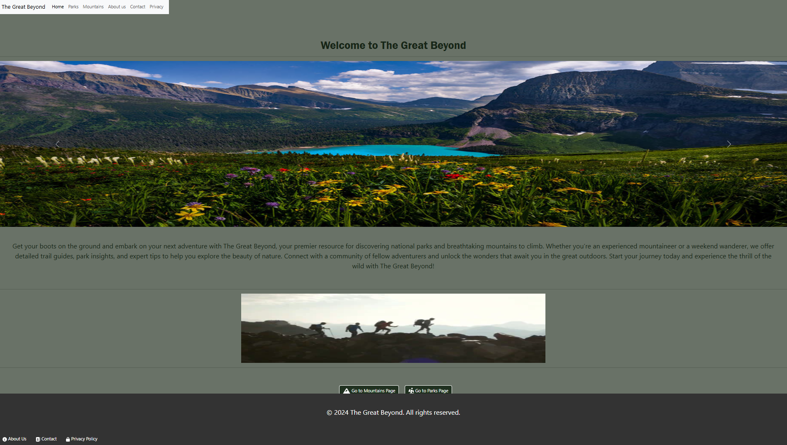
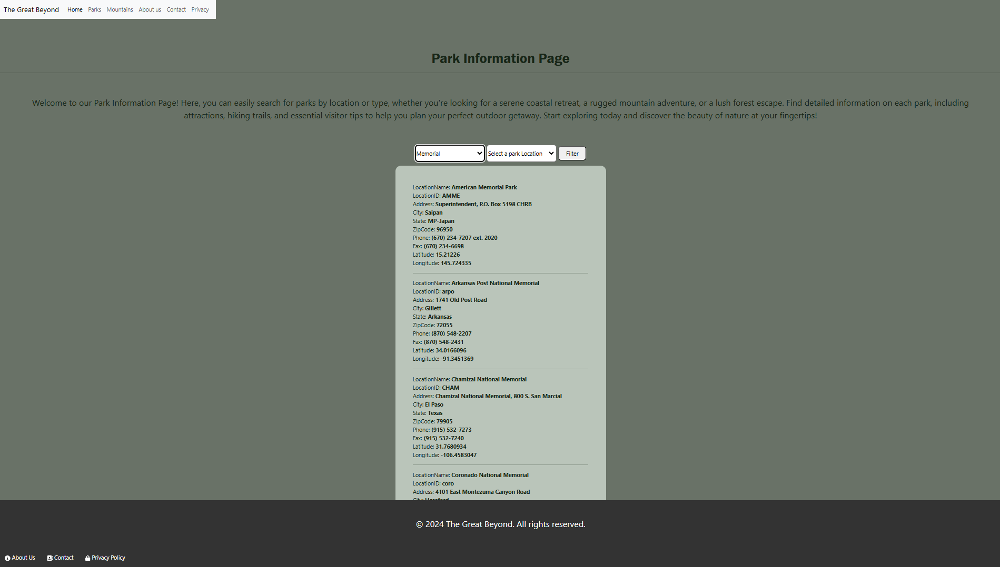
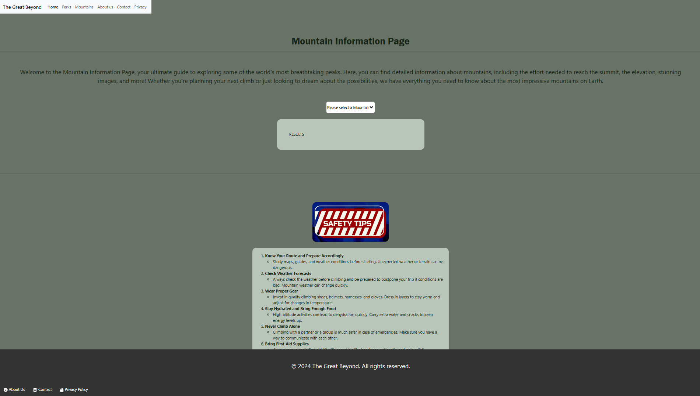
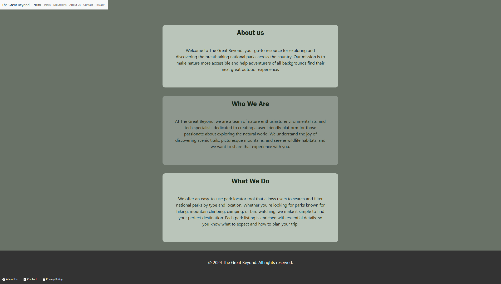
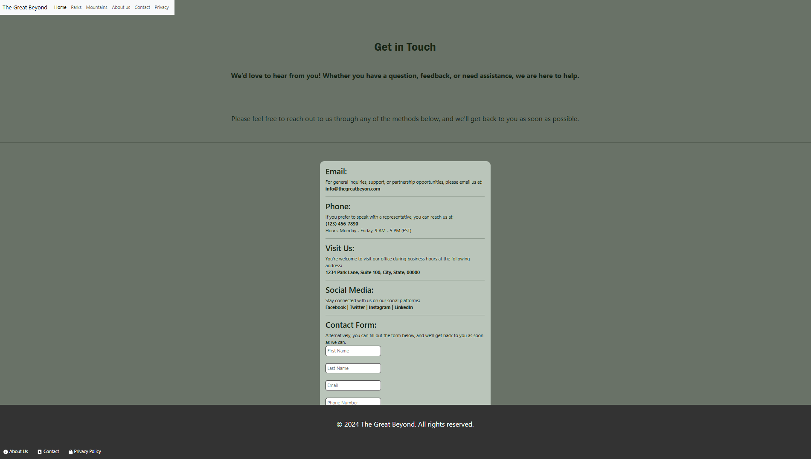
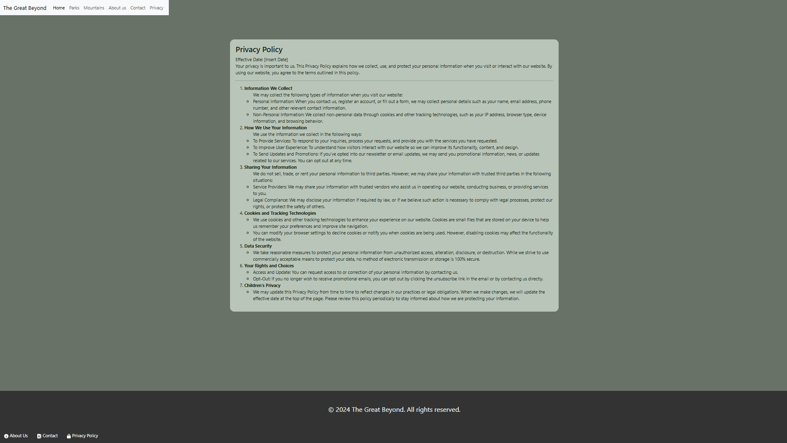

<h1>The Great Beyond locater Page</h1>
 
<h2><b>Synopsis</b> </h2>
 
 

My website is designed to display a list of national parks and let users filter them by specific criteria, such as park type (like "National Park" or "Historic Site") and location (specific states). It uses dropdown menus to allow users to select their preferences and then displays only the parks that match the chosen criteria. If no parks match, a message is displayed.

The site dynamically updates the list based on user selections, ensuring a smooth and interactive experience for exploring park options.

<h2><b>Technologies used</b> </h2>
<li>HTML</li>
<li>CSS</li>
<li>BOOTSTRAP</li>
<li>JavaScript</li>
<li>Chat GPT</li>
 
 

Your website is designed to display a list of national parks and let users filter them by specific criteria, such as park type (like "National Park" or "Historic Site") and location (specific states). It uses dropdown menus to allow users to select their preferences and then displays only the parks that match the chosen criteria. If no parks match, a message is displayed.

The site dynamically updates the list based on user selections, ensuring a smooth and interactive experience for exploring park options.

The landing page titled "The Great Beyond" serves as the introduction to the site, inviting users to explore information about parks and mountains. It provides easy access to all other pages and sets the tone for the website’s theme.

<ul>Key Features:
    <li>Navigation bar with links to all main sections.
    <li>Photo Carosel of diferent mountains</li>
</ul>

This page is dedicated to showcasing a variety of national parks. Users can filter parks by type and location to find specific interests.

<ul>Key Features:
    <li>Filters for park type and location.
    <li>Display of detailed park descriptions and images.</li>
</ul>

 The mountains page offers comprehensive information about selected mountains, including elevation, difficulty level, and descriptions. Users can pick a mountain from a dropdown menu to view its details.

<ul>Key Features:
    <li>Dropdown menu to select mountains.</li>
    <li>Option to display sunrise and sunset information.</li>
    <li>Display of mountain details such as images, elevation, and coordinates.</li>
</ul>

Provides an overview of the purpose of the website and information about the team behind it. This page helps users understand the site's mission and who is responsible for its content.

<ul>Key Features:
    <li>Description of the website’s mission. </li>
    <li>Display of detailed park descriptions and images.</li>
</ul>

A straightforward contact page where users can send messages to the team. Includes a form with fields for name, email, and message content.

<ul>Key Features:
    <li>User-friendly contact form. </li>
    <li>Instructions for how to reach out with questions or feedback.</li>
</ul>

Outlines the privacy policy for the site, detailing how user data is collected, stored, and used. Ensures transparency and builds trust with visitors.

<ul>Key Features:
    <li>Comprehensive description of data policies. </li>
    <li>Explanation of user rights and data handling.</li>
</ul>

